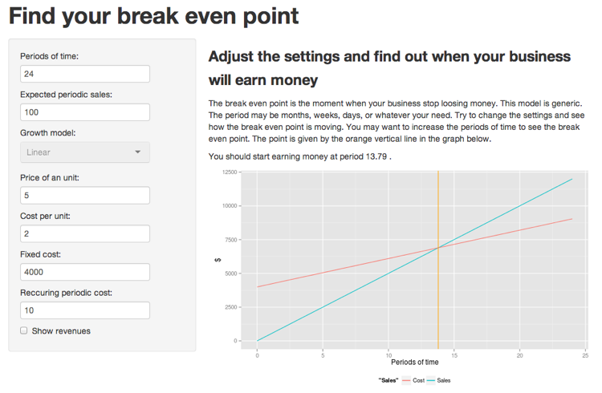

# Break Even

> Find your business break even point with this simple application.



[Break Even on ShinyApps.io](http://kevinlebrun.shinyapps.io/shiny-first-application/)

---

## A little graph

 

The break even point:


```r
fixed_cost / (periodic_sales * price_per_unit
                - periodic_cost
                - periodic_sales * cost_per_unit)
```

```
## [1] 23.08
```

---

## How does the application work?

 1. Fill in your product costs
   - Supports fixed cost, recurring cost, and per unit cost
 2. Define your expected sales
   - How many units you plan to sell in a period of time?
 3. Adjust your price

You should now see your break even point.

Let's create that business!

---

## More to come

 - Define a growth model: linear, logarithmic, exponential, ...
 - Plan cost at certain period of time (ex: new hire).
 - Define a revenue goal and see when it will be achieved.
 - Compare business plan.

## Thank you!

You can find me on:

 - [github](https://github.com/kevinlebrun)
 - [linkedin](https://www.linkedin.com/in/kevinlebrun)
